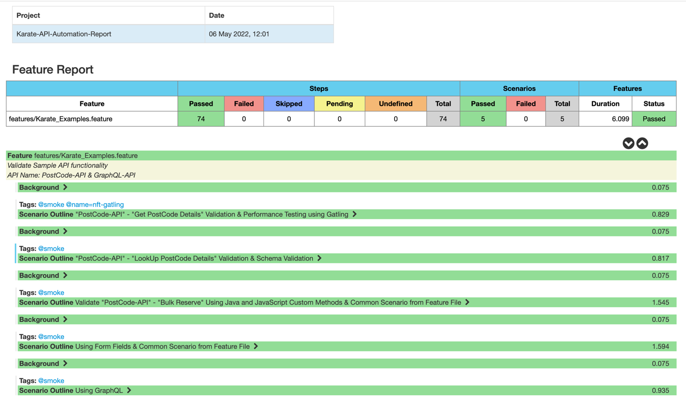

# TestX-API-Karate

**About TestX Karate Automation Framework:**

This karate automation framework accelerator helps in the functional and non-functional validation of RestFull or SOAP Service APIs.

The goal is to automate APIs with minimal code and ease of use, which will allow you to accelerate your automation development.

**Accelerator features & Advantages:**

- Simple framework folder structure
- Tests both REST and SOAP calls.
- No Need to write Step Definitions
- Feature Files can be reused as common features.
- Uses the Simple Karate features of Automate API products.
- Generates test Cucumber reports, Karate Summary Report for Functional Testing.
- Generates Gatling Report for Non-Functional Testing
- BDD in Non-Functional Testing
- Integrated with functional and non-functional testing
- There is no need to write separate non-functional scripts. We can use the existing functional script to test the performance of an API.
- It has an inbuilt mechanism to read or support JSON/CSV and other file formats.
- No programming skills are required.
- Jenkins pipeline integration
- Environment agnostic
- Scenario Level: Parallel execution
- It supports both Java and JavaScript.
- Accelerate Automation deliverables.
- It takes less than 30 minutes to create a new karate framework from scratch.

**Pre-requisites:**

* IntelliJ (https://www.jetbrains.com/idea/) (IntelliJ - Recommended, Supports other tools as well VSCode, Eclipse)
* Java (https://www.java.com/en/download/help/download_options.html)
* Maven (https://maven.apache.org/download.cgi)
* Install Cucumber & Scala plugins (Preferences -> Plugins)

**Commands to run the tests:**

* mvn clean test "-Dkarate.options=--tags @smoke" -DEnv=sit
* mvn clean test -DskipTests=true gatling:test -DEnv=sit

**Results path:** 

-> target/cucumber-html-reports/overview-features.html

-> target/gatling/simulator/index.html

**Karate framework reference:**

API Automation Practice:

https://postcodes.io/

https://reqres.in/

Karate Refs: 

https://github.com/intuit/karate

Schema Validation Refs: https://karatelabs.github.io/karate/#schema-validation

**PSK Certificate generation:**

openssl pkcs12 -inkey karate-dev-team.key -in karate-dev-team.crt -export -out karate-dev-team.pfx

**Karate Performance:**

https://gatling.io/docs/gatling/reference/current/general/simulation_setup/

